# Comprehensive Report on the Dialogue Generation Pipeline

## Table of Contents
1. [Introduction](#introduction)
2. [System Overview](#system-overview)
3. [Configuration Parameters](#configuration-parameters)
4. [Data Inputs](#data-inputs)
    - [Primary Dataset](#primary-dataset)
    - [Persona Dataset](#persona-dataset)
    - [Predefined Regions and Categories](#predefined-regions-and-categories)
5. [Initialization and Setup](#initialization-and-setup)
    - [Logging](#logging)
    - [Natural Language Processing (NLP) Models](#natural-language-processing-nlp-models)
    - [Environment Variables and API Integration](#environment-variables-and-api-integration)
    - [Embedding Models](#embedding-models)
6. [Core Functionalities](#core-functionalities)
    - [Persona Management](#persona-management)
    - [Scenario Generation](#scenario-generation)
    - [Dialogue Extraction and Processing](#dialogue-extraction-and-processing)
    - [Dialogue Generation](#dialogue-generation)
    - [Uniqueness Verification](#uniqueness-verification)
7. [Service and Scenario Management](#service-and-scenario-management)
    - [Service Categories and Combinations](#service-categories-and-combinations)
    - [Scenario Diversification](#scenario-diversification)
8. [Generation Workflow](#generation-workflow)
    - [Sampling and Distribution](#sampling-and-distribution)
    - [Dialogue Generation Loop](#dialogue-generation-loop)
    - [Error Handling and Retries](#error-handling-and-retries)
9. [Data Persistence and Incremental Saving](#data-persistence-and-incremental-saving)
    - [Saving Dialogues](#saving-dialogues)
    - [Embedding and Hash Management](#embedding-and-hash-management)
10. [Testing and Validation](#testing-and-validation)
    - [Single Dialogue Extraction Test](#single-dialogue-extraction-test)
11. [Command-Line Interface](#command-line-interface)
12. [Conclusion](#conclusion)
13. [Appendices](#appendices)
    - [Appendix A: Configuration Parameters Details](#appendix-a-configuration-parameters-details)
    - [Appendix B: Emotion Lists](#appendix-b-emotion-lists)
    - [Appendix C: Resolution Statuses](#appendix-c-resolution-statuses)

---

## Introduction

The **Dialogue Generation Pipeline** is a sophisticated system engineered to produce unique, contextually rich, and emotionally nuanced dialogues between users and assistants. This pipeline leverages advanced natural language processing (NLP) models, embedding techniques, and comprehensive datasets to ensure the generation of high-quality conversational data. Such data is pivotal for training conversational AI systems, enhancing customer support simulations, and various other applications requiring realistic dialogue generation.

This report meticulously details each component and process within the `dialogue_generation.py` script, elucidating the data flows, functionalities, error handling mechanisms, and overall architecture. The aim is to provide a thorough understanding of the pipeline's operations, ensuring that every aspect is transparent and comprehensible.

## System Overview

The pipeline is encapsulated within a Python script named `dialogue_generation.py`, centered around the `DialogueGenerator` class. This class serves as the backbone, orchestrating the entire workflow from data loading and preprocessing to dialogue generation and validation. The pipeline's design emphasizes scalability, modularity, and robustness, ensuring it can handle large volumes of data while maintaining high-quality outputs.

Key Components:
- **Data Management:** Handles loading and preprocessing of primary and persona datasets.
- **Scenario Generation:** Crafts specific scenarios to contextualize dialogues.
- **Dialogue Generation:** Utilizes OpenAI's GPT models to produce dialogues based on prompts and scenarios.
- **Uniqueness Checks:** Ensures generated dialogues are distinct using hashing and semantic embedding comparisons.
- **Emotional Assignment:** Infuses dialogues with predefined user and assistant emotions to enhance realism.
- **Service Management:** Manages various service categories and their logical combinations to diversify dialogue contexts.

The pipeline is designed for flexibility, allowing users to customize generation parameters via command-line arguments, facilitating adaptability to diverse use cases and requirements.

## Configuration Parameters

Configuration parameters are pivotal in tailoring the pipeline's behavior to specific needs. These parameters are defined through command-line arguments, offering both required and optional settings to customize various aspects of the dialogue generation process.

### Required Parameters:
- `--total_generations`: Specifies the total number of dialogues to generate. This is a mandatory argument, ensuring that the pipeline knows the exact volume of dialogues to produce.

### Optional Parameters (with Defaults):
- `--output_file`: Path to the JSON file where generated dialogues are saved. Default is `generated_dialogues.json`.
- `--hash_file`: Path to the JSON file storing hashes of dialogues for duplication checks. Default is `dialogue_hashes.json`.
- `--embedding_file`: Path to the NumPy file storing dialogue embeddings. Default is `dialogue_embeddings.npy`.
- `--similarity_threshold`: Threshold for cosine similarity to determine dialogue uniqueness. Default is `0.9`.
- `--dataset_name`: Name of the primary dataset to use. Default is `pfb30/multi_woz_v22`.
- `--min_turns`: Range for the minimum number of dialogue turns. Default is `5 10`.
- `--max_turns`: Range for the maximum number of dialogue turns. Default is `7 20`.
- `--temperature`: List of temperature values for OpenAI API calls. Default is `[0.7, 0.8, 0.9, 1.0]`.
- `--top_p`: List of top-p values for OpenAI API calls. Default is `[0.8, 0.85, 0.9, 0.95, 1.0]`.
- `--frequency_penalty`: List of frequency penalty values for OpenAI API calls. Default is `[0.0, 0.2, 0.4, 0.6, 0.7]`.
- `--presence_penalty`: List of presence penalty values for OpenAI API calls. Default is `[0.0, 0.2, 0.4, 0.6, 0.7]`.

### Additional Options:
- `--test_extraction`: Flag to test the extraction of a single dialogue. When set, the pipeline runs in testing mode.
- `--extraction_index`: Index of the dialogue to extract for testing. Default is `0`.

These parameters empower users to fine-tune the generation process, ensuring the pipeline can adapt to varying requirements, datasets, and desired dialogue characteristics.

## Data Inputs

Effective dialogue generation hinges on the quality and diversity of input data. The pipeline manages multiple data sources, each serving a distinct purpose in the generation process.

### Primary Dataset

#### Path:
- Stored locally at `./local_datasets/multi_woz_v22`.

#### Structure:
- Utilizes Hugging Face's `datasets` library, specifically the `DatasetDict` format.
- Contains multiple splits (e.g., `train`, `validation`, `test`), with `train` being primarily used.

#### Content:
- Each entry in the dataset represents a dialogue with the following attributes:
  - `dialogue_id`: A unique identifier for each dialogue.
  - `services`: A list of services involved in the dialogue (e.g., `['hotel', 'taxi']`).
  - `turns`: A dictionary containing:
    - `speaker`: List indicating the speaker at each turn (`0` for user, `1` for assistant).
    - `utterance`: List of utterances corresponding to each turn.
    - `turn_id`: List of turn identifiers.

#### Usage:
- Dialogues are extracted, anonymized, and used as references to generate new, unique dialogues.
- Provides the foundational conversational structure upon which new dialogues are built.

### Persona Dataset

#### Path:
- Located at `./local_datasets/FinePersonas-v0.1-clustering-100k`.

#### Structure:
- Loaded using Hugging Face's `datasets` library.
- Contains persona-related data with the following attributes:
  - `cluster_label`: Indicates clustering information for personas, used to group similar personas.
  - `summary_label`: Provides summarized labels for personas, facilitating category-based selection.
  - `persona`: Detailed description of individual personas, offering diverse characteristics.

#### Management:
- **Cluster Dictionary (`self.cluster_dict`):**
  - Maps each `cluster_label` to a list of persona indices.
  - Facilitates cluster-based persona selection, ensuring diversity within clusters.
  
- **Summary Dictionary (`self.summary_dict`):**
  - Maps each `summary_label` (processed into sorted tuples) to a list of persona indices.
  - Enables summary-based persona selection, promoting variability based on summaries.

#### Selection:
- Randomly chooses a persona either from clusters or summaries, ensuring a balanced and diverse representation of user characteristics.
- Enhances the realism of dialogues by infusing them with varied personas.

### Predefined Regions and Categories

#### Regions:

##### List:
- Comprises major global cities to provide geographical context, including but not limited to:
  - Tokyo, Delhi, Shanghai, Sao Paulo, Mumbai, Beijing, Cairo, Mexico City, Dhaka, Osaka, Karachi, Chongqing, Istanbul, Buenos Aires, Kolkata, Kinshasa, Lagos, Manila, Rio de Janeiro, Guangzhou, Los Angeles, Moscow, Paris, Bangkok, Jakarta, London, Lima, New York, Shenzhen, Bangalore, Ho Chi Minh City, Hyderabad, Bogota, Tianjin, Santiago, Sydney, Berlin, Madrid, Toronto, Johannesburg, Dubai, Singapore, Tehran, Baghdad, Riyadh, Rome, Cape Town, Casablanca, Barcelona, Seoul, Melbourne, Copenhagen, Zurich, Kuala Lumpur.

##### Purpose:
- Assigns a geographical context to each generated dialogue, enhancing realism and ensuring dialogues are set in diverse locations.

#### Scenario Categories:

##### General Categories:
- Applicable across all services, ensuring dialogues can encompass universal scenarios such as:
  - `account_management`: Managing user accounts, passwords, etc.
  - `cancellation_general`: General cancellation requests not tied to a specific service.
  - `complaint`: General complaints about services or experiences.
  - `refund_request_general`: Refunds not specific to a service.
  - `payment_issues`: Issues related to payments across services.
  - `general_inquiry`: General questions not specific to any service.
  - `feedback`: Providing feedback about services or experiences.
  - `technical_support`: Technical assistance for app or website issues.
  - `lost_and_found_general`: Reporting lost items not tied to a specific service.

##### Service-Specific Categories:
- Tailored to individual services to ensure dialogues are relevant and context-specific.

###### Restaurant:
- `dining_reservation`: Booking a table for dining.
- `dietary_requirements`: Inquiring or specifying dietary needs.
- `table_modification`: Changing table reservations.
- `special_occasion`: Planning for special events or occasions.
- `menu_inquiry`: Inquiring about menu items or specials.
- `order_status`: Checking the status of an order.
- `reservation_cancellation`: Specific cancellation for reservations.

###### Hotel:
- `room_reservation`: Booking hotel rooms.
- `check_in_out`: Managing check-in and check-out processes.
- `amenity_inquiry`: Inquiring about hotel amenities.
- `room_service`: Requesting room services.
- `booking_modification`: Modifying existing bookings.
- `housekeeping_request`: Requests related to room cleaning and maintenance.
- `reservation_cancellation`: Specific cancellation for hotel bookings.

###### Train:
- `journey_planning`: Planning travel routes.
- `schedule_inquiry`: Inquiring about train schedules.
- `ticket_booking`: Booking train tickets.
- `platform_information`: Information about train platforms.
- `ticket_change`: Changing ticket details.
- `ticket_cancellation`: Specific cancellation for train tickets.
- `seat_selection`: Selecting or changing seats.

###### Attraction:
- `ticket_availability`: Checking availability of attraction tickets.
- `opening_hours`: Inquiring about attraction operating hours.
- `guided_tour`: Booking or inquiring about guided tours.
- `venue_information`: Information about the attraction venue.
- `group_booking`: Booking for groups.
- `ticket_cancellation`: Specific cancellation for attraction tickets.
- `accessibility_inquiry`: Inquiries about accessibility features.

###### Taxi:
- `ride_booking`: Booking a taxi ride.
- `pickup_location`: Specifying or changing pickup locations.
- `fare_inquiry`: Inquiring about ride fares.
- `driver_tracking`: Tracking the assigned driver.
- `ride_cancellation`: Specific cancellation for taxi rides.
- `ride_feedback`: Providing feedback on taxi rides.
- `service_type_inquiry`: Inquiring about different types of taxi services.

###### Hospital:
- `appointment_booking`: Booking medical appointments.
- `department_inquiry`: Inquiring about hospital departments.
- `medical_information`: Seeking medical information.
- `emergency_services`: Accessing emergency services.
- `appointment_cancellation`: Specific cancellation for appointments.
- `insurance_inquiry`: Questions about insurance coverage.
- `medical_record_request`: Requesting medical records.

###### Bus:
- `route_information`: Inquiring about bus routes.
- `schedule_inquiry`: Inquiring about bus schedules.
- `ticket_booking`: Booking bus tickets.
- `stop_location`: Inquiring about bus stop locations.
- `ticket_change`: Changing bus ticket details.
- `ticket_cancellation`: Specific cancellation for bus tickets.
- `seat_selection`: Selecting or changing bus seats.

###### Flight:
- `flight_booking`: Booking flights.
- `cancellation_flight`: Specific cancellation for flights.
- `ticket_change`: Changing flight ticket details.
- `baggage_inquiry`: Inquiring about baggage policies.
- `check_in`: Managing flight check-ins.
- `seat_selection`: Selecting or changing flight seats.
- `flight_status`: Checking flight status.
- `upgrade_request`: Requesting flight upgrades.
- `refund_request_flight`: Refund requests specific to flights.
- `lounge_access`: Inquiring about lounge access.
- `boarding_pass_issue`: Issues related to boarding passes.
- `special_meals`: Requests for special meals on flights.
- `pet_transportation`: Inquiries about transporting pets.

These categories ensure that dialogues are relevant, specific, and tailored to the unique requirements and interactions of each service, enhancing the overall quality and applicability of the generated dialogues.

## Initialization and Setup

Proper initialization and setup are critical for the pipeline's seamless operation. This section delves into the preparatory steps undertaken before the core functionalities are executed.

### Logging

#### Configuration:
- **Library Used:** Python's built-in `logging` module.
- **Logging Level:** Set to `INFO` by default. This level can be adjusted to `DEBUG` for more granular logs if detailed tracing is required.
- **Format:** Logs include timestamps, log levels, and messages, structured as `%(asctime)s [%(levelname)s] %(message)s`.
- **Handlers:**
  - **FileHandler:** Writes logs to `dialogue_generation.log`, ensuring that all operational details are persistently stored.
  - **StreamHandler:** Outputs logs to the console, providing real-time feedback during execution.

#### Purpose:
- **Monitoring:** Tracks the pipeline's operations, including data loading, dialogue generation, and saving processes.
- **Debugging:** Captures errors, warnings, and informational messages to facilitate troubleshooting.
- **Audit Trail:** Maintains a record of all actions performed, aiding in auditing and performance assessments.

### Natural Language Processing (NLP) Models

#### spaCy Model

##### Model Used:
- **Name:** `en_core_web_sm`.
- **Purpose:** Facilitates various NLP tasks such as tokenization, part-of-speech (POS) tagging, named entity recognition (NER), and dependency parsing.

##### Initialization Process:
1. **Attempt to Load Model:**
   - Tries to load the `en_core_web_sm` model using `spacy.load("en_core_web_sm")`.
2. **Error Handling:**
   - If the model is not found (`OSError` is raised), logs an informational message indicating the model is being downloaded.
3. **Model Download and Loading:**
   - Uses `subprocess` to execute the command `python -m spacy download en_core_web_sm`, downloading the required model.
   - After successful download, loads the model again using `spacy.load("en_core_web_sm")`.

##### Purpose in Pipeline:
- **Text Processing:** Enables the pipeline to process and analyze textual data effectively, ensuring accurate extraction and formatting of dialogue turns.
- **Data Cleaning:** Assists in identifying and handling linguistic nuances within utterances, enhancing the quality of generated dialogues.

### Environment Variables and API Integration

#### Environment Variables

##### Loading Mechanism:
- **Library Used:** `dotenv`.
- **File Loaded:** `.env.local`.
- **Key Variable:** `OPENAI_KEY`.

##### Purpose:
- **Security:** Stores sensitive information, such as API keys, securely outside the codebase.
- **Configurability:** Allows users to change API keys or other sensitive parameters without altering the code.

##### Handling:
- **Missing API Key:**
  - If `OPENAI_KEY` is not set, logs an error message and raises an `EnvironmentError`.
  - Prevents the pipeline from proceeding without proper authentication, ensuring secure API interactions.

#### OpenAI Client

##### Initialization:
- **Library Used:** `openai`.
- **Client Initialization:** Uses `OpenAI(api_key=openai_api_key)` to create an authenticated client.

##### Purpose:
- **Dialogue Generation:** Utilizes OpenAI's GPT models (e.g., `gpt-4o-mini`) to generate dialogues based on constructed prompts and scenarios.
- **Scenario Generation:** Employs the client to generate specific scenarios that contextualize dialogues.

##### Error Handling:
- **Missing API Key:** As mentioned, halts execution if `OPENAI_KEY` is not provided.
- **API Errors:** Catches `OpenAIError` during API interactions, logging relevant error messages and handling retries where necessary.

### Embedding Models

#### SentenceTransformer Model

##### Model Used:
- **Library:** `sentence_transformers`.
- **Model Path:** `./models/sentence_transformer`.

##### Purpose:
- **Semantic Embeddings:** Generates vector representations of dialogues to facilitate semantic similarity checks.
- **Uniqueness Verification:** Ensures that generated dialogues are semantically distinct from existing ones, preventing redundancy.

##### Initialization Process:
1. **Attempt to Load Model:**
   - Tries to load the SentenceTransformer model from the specified `model_path` using `SentenceTransformer(model_path)`.
2. **Error Handling:**
   - If loading fails, logs an error message detailing the failure and raises the exception to halt execution.
   - Ensures that the pipeline does not proceed without the necessary embedding capabilities, maintaining the integrity of uniqueness checks.

##### Usage in Pipeline:
- **Generating Embeddings:** Converts generated dialogues into numerical vectors.
- **Comparing Embeddings:** Utilizes cosine similarity to compare new embeddings with existing ones, determining the uniqueness of dialogues.

## Core Functionalities

The `DialogueGenerator` class encapsulates the core functionalities of the pipeline, orchestrating the various processes required for dialogue generation. This section delves into each major function and method, explaining their roles and operations.

### Persona Management

#### Loading Personas

- **Method:** `load_persona_dataset()`
- **Process:**
  - Loads the persona dataset from the specified local path (`./local_datasets/FinePersonas-v0.1-clustering-100k`) using Hugging Face's `load_from_disk`.
  - Extracts the first split (e.g., `train`) from the loaded dataset.

#### Populating Persona Dictionaries

- **Method:** `populate_persona_dicts()`
- **Process:**
  - Iterates through each persona in the dataset.
  - For each persona, appends its index to:
    - **Cluster Dictionary (`self.cluster_dict`):** Based on `cluster_label`.
    - **Summary Dictionary (`self.summary_dict`):** Based on `summary_label`.
  - Utilizes helper methods like `safe_eval` and `get_summary_labels` to process labels accurately.

#### Selecting Random Personas

- **Method:** `select_random_persona()`
- **Process:**
  - Randomly decides whether to select a persona based on clusters or summaries.
  - **Cluster-Based Selection:**
    - Randomly selects a cluster from `self.cluster_dict`.
    - Chooses a random persona index from the selected cluster.
  - **Summary-Based Selection:**
    - Randomly selects a summary from `self.summary_dict`.
    - Chooses a random persona index from the selected summary.
  - Returns the `persona` attribute of the selected persona, providing a detailed persona description.

#### Purpose:
- **Diversity:** Ensures that generated dialogues are infused with a wide range of user personas, enhancing realism.
- **Variability:** By selecting personas based on clusters or summaries, the pipeline avoids repetitive dialogue patterns, promoting varied conversational styles and characteristics.

### Scenario Generation

#### Generating Dynamic Scenarios

- **Method:** `generate_dynamic_scenario(category: str, listservice: list, region: str) -> str`
- **Inputs:**
  - `category`: The scenario category (e.g., `dining_reservation`).
  - `listservice`: List of services involved in the dialogue (e.g., `['hotel', 'taxi']`).
  - `region`: The geographical region assigned to the dialogue.
  
- **Process:**
  1. **Category Validation:**
     - Retrieves valid categories for the primary service using `get_categories_for_service`.
     - If the provided `category` is invalid for the service, randomly selects a new valid category and logs the change.
  
  2. **Persona Selection:**
     - Selects a random persona using `select_random_persona`.
     - Logs the selected persona for transparency.
  
  3. **Time Slot Selection:**
     - Chooses a random time slot from `self.travel_time_slots`, which defines various periods (e.g., Early Morning, Afternoon).
     - Generates a specific time within the selected slot using `generate_random_time`.
     - Logs the selected time and slot name.
  
  4. **System and User Prompts Construction:**
     - **System Prompt:**
       - Instructs the assistant to generate a specific scenario relevant to the given category and service.
       - Emphasizes perspective from the selected persona, incorporation of time and region specifics, and concise length (2-3 lines).
     - **User Prompt:**
       - Requests a scenario for the specified category and service, reinforcing the importance of time slot and region.
  
  5. **API Call:**
     - Invokes OpenAI's `chat.completions.create` with the constructed prompts.
     - Specifies model (`gpt-4o-mini`), token limits (`max_tokens=150`), and other parameters like `temperature` and `top_p`.
  
  6. **Response Handling:**
     - Extracts the generated scenario from the API response.
     - Logs the generated scenario for tracking and validation.
     - Returns the scenario string and the selected time slot.
  
- **Error Handling:**
  - Catches `OpenAIError` and general exceptions, logging relevant error messages.
  - Returns `None` for both scenario and time slot if generation fails, allowing the pipeline to skip problematic dialogues.

#### Purpose:
- **Contextualization:** Provides a specific scenario that grounds the generated dialogue, ensuring it aligns with the selected category, service, persona, region, and time.
- **Guidance:** Directs the OpenAI model to produce relevant and concise scenarios, enhancing the relevance and quality of generated dialogues.

### Dialogue Extraction and Processing

#### Extracting Dialogues

- **Method:** `extract_dialogue(dialogue_json: Dict) -> List[Dict]`
- **Input:** A JSON object representing a single dialogue from the primary dataset.
  
- **Process:**
  1. **Retrieval:**
     - Extracts `dialogue_id` and `turns` data (`speaker`, `utterance`, `turn_id`) from the input JSON.
  
  2. **Processing Turns:**
     - Iterates through each turn, mapping numeric speaker labels (`0` to "USER", `1` to "ASSISTANT", others to "UNKNOWN").
     - Constructs a list of turn dictionaries, each containing:
       - `turn_id`: Identifier for the turn.
       - `speaker`: Label indicating "USER" or "ASSISTANT".
       - `utterance`: The spoken text.
  
  3. **Logging:**
     - Logs information about the `dialogue_id` and the number of speakers, utterances, and turns processed.
     - Logs the total number of turns extracted.
  
- **Output:** A structured list of turns with labeled speakers and corresponding utterances.

#### Generating Base Conversation

- **Method:** `generate_base_conversation(turns: List[Dict]) -> str`
- **Input:** A list of turn dictionaries extracted from a dialogue.
  
- **Process:**
  1. **Formatting:**
     - Iterates through each turn, formatting them into strings with speakers labeled as "USER" or "ASSISTANT" followed by their utterances.
     - Example:
       ```
       USER: Hello, I’d like to book a table for two at your restaurant.
       ASSISTANT: Certainly! What time would you prefer?
       ```
  
  2. **Joining Turns:**
     - Combines all formatted turns into a single string separated by newline characters.
  
  3. **Logging:**
     - Logs a preview of the base conversation, including the first few and last few turns if the conversation is lengthy (commented out in the code).
     - Logs the total number of turns in the conversation.
  
- **Output:** A base conversation string that serves as a reference point for generating new dialogues.

#### Purpose:
- **Reference Generation:** Provides a foundational conversational structure that guides the generation of new, contextually relevant dialogues.
- **Anonymization:** Ensures that extracted dialogues are formatted and potentially anonymized, maintaining privacy and confidentiality.

### Dialogue Generation

#### Generating New Dialogues

- **Method:** `generate_dialogue(...) -> str`
- **Inputs:**
  - `listservice`: List of services involved in the dialogue.
  - `prompt`: The user prompt incorporating the base conversation.
  - `min_turns`: Minimum number of dialogue turns.
  - `max_turns`: Maximum number of dialogue turns.
  - `temperature`, `top_p`, `frequency_penalty`, `presence_penalty`: Dynamic parameters for the OpenAI API call.
  - `max_retries`: Maximum number of retries for API calls.
  - `user_emotions`: List of emotions assigned to the user.
  - `assistant_emotions`: List of emotions assigned to the assistant.
  - `scenario`: The scenario string guiding the dialogue.
  - `regions`: List of regions assigned to the dialogue.
  
- **Process:**
  1. **Prompt Construction:**
     - **Emotion Integration:** Converts user and assistant emotions into strings.
     - **Scenario and Region Integration:** Includes scenario details and region information if provided.
     - **System Prompt:**
       - Defines the role of the assistant as an expert dialogue generator for the specified services.
       - Incorporates scenario, region, emotions, turn limits, and resolution status.
       - Specifies the desired format for each turn using XML-like tags (`<User>`, `<Intent>`, `<Assistant>`).
  
  2. **User Prompt:**
     - Provides the base conversation and instructions to create a new, relevant dialogue.
     - Specifies the resolution status (e.g., Resolved, Failed, Escalated), influencing the dialogue's outcome.
  
  3. **API Interaction:**
     - Invokes OpenAI's `chat.completions.create` method with the constructed prompts.
     - Sets parameters like `model`, `max_tokens`, `temperature`, `top_p`, `frequency_penalty`, and `presence_penalty`.
     - Requests a single completion (`n=1`) to maintain quality control.
  
  4. **Response Handling:**
     - Extracts generated dialogues from the API response.
     - Validates the format of each generated dialogue using regex to ensure it contains the expected XML-like tags.
     - Returns the first valid formatted dialogue.
     - If no valid dialogue is found, logs a warning and retries the API call up to `max_retries` times with exponential backoff.
  
- **Error Handling:**
  - Catches `OpenAIError` and logs relevant error messages.
  - Implements retries with exponential backoff (sleeping for `2 ** attempt` seconds between attempts).
  - Logs errors and warnings for failed attempts and invalid formats.

#### Purpose:
- **Dialogue Creation:** Generates new, contextually relevant dialogues based on the provided prompts, scenarios, and assigned emotions.
- **Format Enforcement:** Ensures that generated dialogues adhere to the expected structured format, facilitating downstream processing and analysis.
- **Quality Control:** Implements validation and retry mechanisms to maintain high-quality outputs and handle potential API inconsistencies.

### Uniqueness Verification

#### Ensuring Dialogues are Unique

- **Method:** `is_unique(conversation_embedding: np.ndarray) -> bool`
- **Input:** A NumPy array representing the embedding of the generated conversation.
  
- **Process:**
  1. **Embedding Check:**
     - If `self.existing_embeddings` is empty, considers the dialogue unique by default.
  
  2. **Similarity Calculation:**
     - Computes cosine similarity between the new dialogue's embedding and all existing embeddings using `cosine_similarity`.
  
  3. **Threshold Comparison:**
     - Determines the maximum similarity score.
     - If `max_similarity` is greater than or equal to `self.similarity_threshold` (default: `0.9`), the dialogue is deemed non-unique.
     - Otherwise, it is considered unique.
  
- **Output:** Returns `True` if the dialogue is unique; `False` otherwise.

#### Purpose:
- **Avoiding Redundancy:** Ensures that each generated dialogue is distinct, preventing repetition and enhancing the diversity of the dataset.
- **Semantic Distinction:** Goes beyond exact matches by using semantic embeddings to detect dialogues that may be phrased differently but convey similar meanings.


#### Assigning Emotions to Dialogues

- **Method:** `assign_selected_emotions(turns: List[Dict], user_emotions: List[str], assistant_emotions: List[str]) -> List[Dict]`
- **Inputs:**
  - `turns`: List of turn dictionaries extracted from the generated dialogue.
  - `user_emotions`: List of emotions assigned to the user.
  - `assistant_emotions`: List of emotions assigned to the assistant.
  
- **Process:**
  - **Current Implementation:** The method currently returns the turns unchanged.
  - **Intended Functionality:**
    - The method is designed to assign emotions to each turn based on the speaker.
    - **Example Implementation (Not Present):**
      - For each turn:
        - If the speaker is "USER", assign a randomly selected emotion from `user_emotions`.
        - If the speaker is "ASSISTANT", assign a randomly selected emotion from `assistant_emotions`.
      - Update each turn dictionary with an `emotion` field reflecting the assigned emotion.
  
- **Output:** Returns the list of turn dictionaries, potentially updated with emotion assignments.

#### Purpose:
- **Emotional Realism:** Infuses dialogues with emotional tones, making conversations more realistic and engaging.
- **Variety:** Allows for diverse emotional expressions, reflecting different user states and assistant responses.

#### Note:
- **Current State:** The `assign_selected_emotions` method is a placeholder and does not currently assign emotions. To fulfill its intended purpose, further implementation is required.

## Service and Scenario Management

Effective management of services and scenarios ensures that generated dialogues are contextually relevant and cover a wide range of interactions.

### Service Categories and Combinations

#### Core Services

- **List of Core Services (`CORE_SERVICES`):**
  - `hotel`
  - `restaurant`
  - `train`
  - `attraction`
  - `taxi`
  - `bus`
  - `hospital`
  - `flight`

#### Categories

##### General Categories:
- Applicable across all services, ensuring that dialogues can cover universal interaction scenarios.
  - `account_management`
  - `cancellation_general`
  - `complaint`
  - `refund_request_general`
  - `payment_issues`
  - `general_inquiry`
  - `feedback`
  - `technical_support`
  - `lost_and_found_general`

##### Service-Specific Categories:
- Tailored to individual services to maintain contextual relevance.
  - **Restaurant:** `dining_reservation`, `dietary_requirements`, etc.
  - **Hotel:** `room_reservation`, `check_in_out`, etc.
  - **Train:** `journey_planning`, `schedule_inquiry`, etc.
  - **Attraction:** `ticket_availability`, `opening_hours`, etc.
  - **Taxi:** `ride_booking`, `fare_inquiry`, etc.
  - **Hospital:** `appointment_booking`, `medical_information`, etc.
  - **Bus:** `route_information`, `schedule_inquiry`, etc.
  - **Flight:** `flight_booking`, `cancellation_flight`, etc.

#### Logical Combinations

- **Double Combinations:** Pairings of two services that commonly interact.
  - Examples:
    - `['hospital', 'taxi']`
    - `['flight', 'hotel']`
    - `['restaurant', 'taxi']`
  
- **Triple Combinations:** Groupings of three services to simulate more complex interactions.
  - Examples:
    - `['hospital', 'taxi', 'hotel']`
    - `['flight', 'train', 'taxi']`
  
- **Quadruple Combinations:** Extensive groupings of four services for highly complex dialogues.
  - Examples:
    - `['flight', 'train', 'hotel', 'taxi']`

#### Weights

- **Service Weights (`SERVICE_WEIGHTS`):**
  - `single`: 30% (30% of dialogues involve a single service)
  - `double`: 35% (35% involve two services)
  - `triple`: 25% (25% involve three services)
  - `quadruple`: 10% (10% involve four services)

#### Combination Usage Tracking

- **Structure (`combination_usage`):**
  - Tracks the number of times each service combination is used.
  - **Single:** Tracks usage per core service.
  - **Double, Triple, Quadruple:** Tracks usage per sorted tuple of service combinations.
  
- **Purpose:**
  - Ensures balanced representation of different service combinations.
  - Prevents overuse of certain combinations, promoting diversity in generated dialogues.

#### Purpose:
- **Realism:** Simulates realistic interactions where multiple services may be involved in a single conversation.
- **Diversity:** Enhances the variety of dialogues by incorporating different combinations of services.

### Scenario Diversification

#### Enhancing Variability

- **Category Selection:**
  - Selects relevant categories based on the primary service.
  - Ensures that the scenario aligns with the selected service's specific categories.
  
- **Scenario Generation (`generate_dynamic_scenario`):**
  - Creates unique scenarios incorporating selected categories, services, personas, regions, and time slots.
  - Ensures each scenario is contextually rich, detailed, and specific.
  
- **Time Slot Integration:**
  - Defines various time periods (e.g., Early Morning, Afternoon) to add temporal context.
  - Generates specific times within selected slots to enhance realism.
  
- **Persona and Region Integration:**
  - Incorporates randomly selected personas to add depth.
  - Assigns a random region from the predefined list to situate the scenario geographically.
  
- **System and User Prompts:**
  - Guides the OpenAI model to generate scenarios that are concise (2-3 lines), detailed, and pertinent to the provided parameters.
  - Emphasizes the inclusion of local context and regional specifics where appropriate.

#### Purpose:
- **Contextual Richness:** Provides a specific backdrop that grounds the generated dialogue, ensuring relevance and coherence.
- **Diversity:** Promotes a wide range of scenarios, preventing monotony and enhancing the applicability of dialogues across various contexts.

## Generation Workflow

The generation workflow orchestrates the end-to-end process of producing unique and contextually relevant dialogues. This section outlines each step, ensuring a comprehensive understanding of the pipeline's operations.

### Sampling and Distribution

#### Service Quotas

- **Calculation:**
  - Determines the number of dialogues to allocate to each core service based on `SERVICE_WEIGHTS`.
  - **Formula:**
    - `dialogues_per_service = num_generations // total_services`
    - Handles remainders by distributing extra dialogues to services as needed.
  
- **Allocation:**
  - **Iterates through each core service, assigning `dialogues_per_service` dialogues.**
  - Ensures that the total allocated dialogues match `num_generations`.

#### Combination Usage Tracking

- **Purpose:**
  - Monitors and maintains balanced usage of service combinations.
  - Prevents overrepresentation of specific combinations, promoting diversity.
  
- **Implementation:**
  - Initializes `combination_usage` as a nested dictionary tracking usage counts for single, double, triple, and quadruple combinations.
  - Increments usage counts as combinations are utilized during dialogue generation.

#### Randomization

- **Shuffling:**
  - Randomly shuffles selected indices to mix services and prevent clustering.
  - Enhances the randomness and unpredictability of service assignments across generated dialogues.
  
- **Selection:**
  - Chooses service combinations based on usage tracking and defined weights.
  - Ensures that the least used combinations are prioritized, promoting balanced distribution.

#### Purpose:
- **Balanced Representation:** Ensures that all services and their combinations are fairly represented in the generated dialogues.
- **Diversity:** Promotes a wide range of interactions, reflecting realistic service-related conversations.

### Dialogue Generation Loop

The dialogue generation loop is the heart of the pipeline, iterating through selected dataset indices to produce unique and contextually rich dialogues. This loop integrates various components, ensuring each dialogue is comprehensive and unique.

#### Step-by-Step Process:

1. **Service Selection:**
   - **Determine Service Count:**
     - Randomly selects the number of services involved (`single`, `double`, `triple`, `quadruple`) based on `SERVICE_WEIGHTS`.
   - **Select Service Combination:**
     - For `single`, selects the least used single service from `CORE_SERVICES`.
     - For `double`, `triple`, `quadruple`, selects the least used combination from `LOGICAL_COMBINATIONS`.
   - **Shuffle Services:**
     - Randomly shuffles the selected services to avoid predictable ordering.
  
2. **Region Assignment:**
   - **Random Selection:**
     - Assigns a random region from `PREDEFINED_REGIONS` to the dialogue.
   - **Logging:**
     - Logs the assigned region for tracking and validation.
  
3. **Dialogue Extraction:**
   - **Process:**
     - Extracts the base conversation from the primary dataset using `extract_dialogue`.
     - Formats the conversation using `generate_base_conversation`.
   - **Anonymization:**
     - Ensures that dialogues are anonymized to maintain privacy and confidentiality.
  
4. **Hashing:**
   - **Compute Hash:**
     - Generates a SHA-256 hash of the base conversation.
   - **Duplicate Check:**
     - Compares the hash against `existing_hashes`.
     - If a duplicate is found, skips dialogue generation to prevent redundancy.
  
5. **Scenario Generation:**
   - **Select Category:**
     - Randomly selects a category relevant to the primary service using `get_categories_for_service`.
   - **Generate Scenario:**
     - Creates a unique scenario using `generate_dynamic_scenario`, incorporating the selected category, services, region, and persona.
   - **Validation:**
     - If scenario generation fails, skips the current dialogue.
  
6. **Emotion Selection:**
   - **Random Sampling:**
     - Selects a random emotion for the user from `USER_EMOTION_LIST`.
     - Selects a random emotion for the assistant from `ASSISTANT_EMOTION_LIST`.
   - **Logging:**
     - Logs the selected emotions for transparency.
  
7. **Resolution Status:**
   - **Selection:**
     - Randomly determines the dialogue's resolution status (`Resolved`, `Failed`, `Escalated`) based on predefined probabilities (`RESOLUTION_STATUSES`).
   - **Influence on Prompt:**
     - Adjusts the user prompt to guide the OpenAI model in shaping the dialogue's outcome accordingly.
  
8. **Prompt Construction:**
   - **Base Conversation:**
     - Incorporates the extracted base conversation into the prompt.
   - **Additional Instructions:**
     - Specifies requirements such as resolution status and ensures that the dialogue is new and more engaging than existing ones.
  
9. **Dialogue Generation:**
   - **Invoke `generate_dialogue`:**
     - Passes the constructed prompt and dynamic parameters to generate a new dialogue.
   - **Output:**
     - Receives the generated dialogue string if successful.
  
10. **Processing and Validation:**
    - **Parse Dialogue:**
      - Uses `process_generated_dialogue` to extract individual turns from the generated dialogue.
    - **Assign Emotions:**
      - Applies assigned emotions to each turn based on the speaker.
    - **Uniqueness Check:**
      - Generates embeddings for the new dialogue.
      - Verifies semantic uniqueness using `is_unique`.
    - **Duplication Handling:**
      - If the dialogue is not unique, skips saving and proceeds to the next iteration.
  
11. **Data Persistence:**
    - **Batch Accumulation:**
      - Accumulates generated dialogues in batches (e.g., 10,000) for efficient saving.
    - **Saving:**
      - Invokes `save_new_dialogues` to persist dialogues, update embeddings, and hashes.
    - **Logging:**
      - Logs the number of dialogues saved in each batch.
  
12. **Finalization:**
    - **Post-Loop Saving:**
      - Saves any remaining dialogues after completing the loop.
    - **Completion Logging:**
      - Logs the completion of the dialogue generation process.

#### Purpose:
- **Comprehensive Generation:** Ensures that each dialogue is contextually rich, unique, and aligned with the specified parameters.
- **Efficiency:** Utilizes batch processing and tracking mechanisms to handle large volumes of dialogue generation without compromising performance.
- **Quality Assurance:** Integrates multiple validation steps to maintain high-quality outputs and prevent duplication.

### Error Handling and Retries

Robust error handling is integral to maintaining the pipeline's reliability and ensuring uninterrupted operation.

#### API Errors:
- **Detection:**
  - Catches `OpenAIError` exceptions during API interactions.
- **Response:**
  - Logs a warning message detailing the error.
  - Implements a retry mechanism with exponential backoff (delays of `2 ** attempt` seconds) up to a maximum of `max_retries` attempts.
- **Final Outcome:**
  - If all retries fail, logs an error message and skips the current dialogue generation attempt.

#### Format Validation:
- **Method:**
  - Utilizes regex to ensure generated dialogues contain the expected XML-like tags (`<User>`, `<Intent>`, `<Assistant>`).
- **Response:**
  - If the format is invalid, logs a warning and retries the API call.
  - Skips dialogue generation after exhausting all retries without obtaining a valid format.

#### Uniqueness Checks:
- **Method:**
  - Compares generated dialogues against existing hashes and semantic embeddings.
- **Response:**
  - If a dialogue fails the uniqueness check (either exact duplicate or semantically similar), logs a warning and skips saving.
  - Proceeds to generate the next dialogue without affecting the overall generation process.

#### Logging:
- **Purpose:**
  - Records all errors, warnings, and informational messages.
  - Facilitates debugging by providing detailed insights into failures and anomalies.
  
#### Purpose:
- **Reliability:** Ensures that transient errors do not halt the entire generation process.
- **Transparency:** Provides clear logs for monitoring and troubleshooting.
- **Data Integrity:** Prevents the saving of flawed or duplicate dialogues, maintaining the quality of the dataset.

## Data Persistence and Incremental Saving

Efficient data persistence mechanisms are essential for handling large volumes of generated dialogues while ensuring data integrity and preventing loss.

### Saving Dialogues

#### Method: `save_new_dialogues(new_dialogues: List[Dict])`

##### Process:
1. **Load Existing Dialogues:**
   - Checks if `output_file` exists.
   - If it does, loads existing dialogues to prevent overwriting.
   - If loading fails, logs a warning and initializes an empty list.
  
2. **Combine Dialogues:**
   - Merges existing dialogues with `new_dialogues`.
  
3. **Save to Output File:**
   - Writes the combined dialogues to `output_file` in JSON format with indentation for readability.
  
4. **Logging:**
   - Logs the number of new dialogues saved.
   - Logs the total number of dialogues after saving.

#### Purpose:
- **Data Integrity:** Ensures that new dialogues are appended without overwriting existing data.
- **Scalability:** Facilitates the handling of large datasets by enabling incremental saving.
- **Accessibility:** Saves dialogues in a structured JSON format, making them easily accessible for downstream applications.

### Embedding and Hash Management

#### Saving Embeddings

##### Method: `save_embeddings(embeddings: np.ndarray)`

##### Process:
1. **Saving:**
   - Utilizes NumPy's `save` function to write the `embeddings` array to `embedding_file`.
  
2. **Logging:**
   - Logs the number of embeddings saved and the file path.

#### Purpose:
- **Uniqueness Verification:** Maintains a comprehensive record of embeddings to facilitate semantic similarity checks.
- **Efficiency:** Uses binary format (`.npy`) for fast loading and storage.

#### Updating Dialogue Hashes

##### Process:
1. **Convert Hash Set to List:**
   - Converts `existing_hashes` (a set) to a list for JSON serialization.
  
2. **Saving:**
   - Writes the list of hashes to `hash_file` in JSON format with indentation for readability.
  
3. **Logging:**
   - Logs the total number of hashes saved.

#### Purpose:
- **Duplication Prevention:** Maintains a persistent record of dialogue hashes to detect and prevent exact duplicates.
- **Performance:** Enables quick hash-based lookups during uniqueness verification.

#### Purpose:
- **Data Synchronization:** Ensures that embeddings and hashes are consistently updated alongside saved dialogues.
- **Preventing Duplicates:** Maintains records to facilitate efficient checks against previously generated dialogues.

## Testing and Validation

Ensuring the correctness and reliability of the pipeline is paramount. The pipeline includes mechanisms to test and validate its functionalities.

### Single Dialogue Extraction Test

#### Method: `test_single_dialogue_extraction(index: int = 0)`

##### Purpose:
- **Validation:** Confirms that the dialogue extraction and formatting processes work correctly.
- **Debugging:** Helps identify issues in data processing steps before running full-scale generation.

##### Process:
1. **Index Verification:**
   - Checks if the provided `index` is within the bounds of the dataset.
   - Logs an error and exits if the index is out of bounds.
  
2. **Dialogue Extraction:**
   - Extracts the dialogue at the specified `index` using `extract_dialogue`.
  
3. **Base Conversation Generation:**
   - Formats the extracted dialogue into a base conversation string using `generate_base_conversation`.
  
4. **Logging:**
   - Logs detailed information about the extracted dialogue, including `dialogue_id`, number of speakers, utterances, turns, and the formatted base conversation.

##### Usage:
- **Command-Line Invocation:**
  - Run the script with the `--test_extraction` flag and optionally specify `--extraction_index`.
  - Example: `python dialogue_generation.py --test_extraction --extraction_index 5`
  
- **Outcome:**
  - Outputs logs detailing the extraction and formatting of the specified dialogue, allowing users to verify the correctness of these processes.

#### Purpose:
- **Quality Assurance:** Validates that dialogues are being correctly extracted and formatted, ensuring the integrity of the base conversations used for generation.
- **Early Detection:** Identifies potential issues in data handling, enabling prompt resolution before extensive generation tasks.

## Command-Line Interface

The pipeline offers a flexible and user-friendly command-line interface (CLI), allowing users to configure and control its operations seamlessly.

### Argument Parsing

#### Method: `parse_arguments()`

##### Library Used:
- Python's `argparse` module.

##### Defined Arguments:

1. **Required Argument:**
   - `--total_generations`: Specifies the total number of dialogues to generate. **Type:** `int`. **Help:** `Total number of dialogues to generate.`

2. **Optional Arguments:**
   - `--output_file`: Path to the JSON file for saving generated dialogues. **Type:** `str`. **Default:** `generated_dialogues.json`. **Help:** `Output JSON file to save generated dialogues.`
   - `--hash_file`: Path to the JSON file for storing dialogue hashes. **Type:** `str`. **Default:** `dialogue_hashes.json`. **Help:** `Hash file to save dialogue hashes.`
   - `--embedding_file`: Path to the NumPy file for storing embeddings. **Type:** `str`. **Default:** `dialogue_embeddings.npy`. **Help:** `File to save dialogue embeddings.`
   - `--similarity_threshold`: Threshold for cosine similarity in uniqueness checks. **Type:** `float`. **Default:** `0.9`. **Help:** `Similarity threshold for uniqueness (e.g., 0.9).`
   - `--dataset_name`: Name of the primary dataset to use. **Type:** `str`. **Default:** `pfb30/multi_woz_v22`. **Help:** `Name of the dataset to use.`
   - `--min_turns`: Range for minimum number of dialogue turns. **Type:** `int`, **nargs:** `2`. **Default:** `[5, 10]`. **Help:** `Minimum turns range (e.g., 5 10).`
   - `--max_turns`: Range for maximum number of dialogue turns. **Type:** `int`, **nargs:** `2`. **Default:** `[7, 20]`. **Help:** `Maximum turns range (e.g., 7 20).`
   - `--temperature`: List of temperature values for OpenAI API calls. **Type:** `float`, **nargs:** `+`. **Default:** `[0.7, 0.8, 0.9, 1.0]`. **Help:** `Temperature options for OpenAI API.`
   - `--top_p`: List of top-p values for OpenAI API calls. **Type:** `float`, **nargs:** `+`. **Default:** `[0.8, 0.85, 0.9, 0.95, 1.0]`. **Help:** `Top-p options for OpenAI API.`
   - `--frequency_penalty`: List of frequency penalty values for OpenAI API calls. **Type:** `float`, **nargs:** `+`. **Default:** `[0.0, 0.2, 0.4, 0.6, 0.7]`. **Help:** `Frequency penalty options for OpenAI API.`
   - `--presence_penalty`: List of presence penalty values for OpenAI API calls. **Type:** `float`, **nargs:** `+`. **Default:** `[0.0, 0.2, 0.4, 0.6, 0.7]`. **Help:** `Presence penalty options for OpenAI API.`

3. **Additional Options:**
   - `--test_extraction`: Flag to test the extraction of a single dialogue. **Action:** `store_true`. **Help:** `Test extraction of a single dialogue.`
   - `--extraction_index`: Index of the dialogue to extract for testing. **Type:** `int`. **Default:** `0`. **Help:** `Index of the dialogue to extract for testing.`

#### Purpose:
- **Flexibility:** Allows users to customize various aspects of the dialogue generation process without modifying the code.
- **User Control:** Empowers users to specify parameters like the number of dialogues, output paths, similarity thresholds, and API configurations.
- **Testing:** Provides options to validate data extraction processes, ensuring the pipeline functions correctly before large-scale generation.

### Execution Flow

#### Method: `main()`

##### Process:
1. **Parse Arguments:**
   - Invokes `parse_arguments()` to retrieve user-specified configurations.
  
2. **Configuration Dictionary:**
   - Constructs a `config` dictionary containing all relevant parameters, converting list-based arguments to tuples where necessary.
  
3. **Initialize `DialogueGenerator`:**
   - Creates an instance of `DialogueGenerator` with the provided `config`.
  
4. **Mode Selection:**
   - **Testing Mode:** If `--test_extraction` is set, invokes `test_single_dialogue_extraction` with the specified `--extraction_index`.
   - **Generation Mode:** Otherwise, invokes `generate_unique_dialogues` with the specified parameters to commence dialogue generation.
  
5. **Execution:**
   - The pipeline proceeds based on the selected mode, either performing a single dialogue extraction test or generating the desired number of dialogues.

#### Purpose:
- **Entry Point:** Serves as the main execution entry point, orchestrating the initialization and operational modes based on user input.
- **Seamless Operation:** Ensures that the pipeline behaves predictably based on provided configurations, enhancing user experience and reliability.

## Data Inputs

[Note: This section seems to have been covered earlier. Ensure no duplication.]

## Appendices

### Appendix A: Configuration Parameters Details

| Parameter               | Type       | Default                | Description                                                            |
|-------------------------|------------|------------------------|------------------------------------------------------------------------|
| `--total_generations`   | `int`      | **Required**           | Total number of dialogues to generate.                                |
| `--output_file`         | `str`      | `generated_dialogues.json` | Path to the JSON file where generated dialogues are saved.            |
| `--hash_file`           | `str`      | `dialogue_hashes.json` | Path to the JSON file storing hashes of dialogues for duplication checks. |
| `--embedding_file`      | `str`      | `dialogue_embeddings.npy` | Path to the NumPy file storing dialogue embeddings.                  |
| `--similarity_threshold`| `float`    | `0.9`                  | Threshold for cosine similarity to determine dialogue uniqueness.     |
| `--dataset_name`        | `str`      | `pfb30/multi_woz_v22` | Name of the primary dataset to use.                                   |
| `--min_turns`           | `int`, 2 values | `[5, 10]`             | Range for the minimum number of dialogue turns.                       |
| `--max_turns`           | `int`, 2 values | `[7, 20]`             | Range for the maximum number of dialogue turns.                       |
| `--temperature`         | `float`, multiple | `[0.7, 0.8, 0.9, 1.0]` | Temperature options for OpenAI API.                                   |
| `--top_p`               | `float`, multiple | `[0.8, 0.85, 0.9, 0.95, 1.0]` | Top-p options for OpenAI API.                                         |
| `--frequency_penalty`   | `float`, multiple | `[0.0, 0.2, 0.4, 0.6, 0.7]` | Frequency penalty options for OpenAI API.                             |
| `--presence_penalty`    | `float`, multiple | `[0.0, 0.2, 0.4, 0.6, 0.7]` | Presence penalty options for OpenAI API.                              |
| `--test_extraction`     | Flag       | `False`                | Flag to test the extraction of a single dialogue.                     |
| `--extraction_index`    | `int`      | `0`                    | Index of the dialogue to extract for testing.                         |

### Appendix B: Emotion Lists

#### User Emotions (`USER_EMOTION_LIST`):
- Frustrated
- Angry
- Confused
- Worried
- Disappointed
- Happy
- Anxious
- Impatient
- Skeptical
- Desperate
- Overwhelmed
- Hopeful
- Satisfied
- Stressed
- Suspicious
- Tired
- Excited
- Indifferent
- Grateful
- Demanding

#### Assistant Emotions (`ASSISTANT_EMOTION_LIST`):
- Professional
- Informative
- Reassuring
- Diplomatic
- Patient
- Efficient
- Accommodating
- Solution-focused
- Methodical
- Proactive
- Analytical
- Composed
- Detail-oriented
- Responsive
- Thorough
- Systematic
- Precise
- Objective
- Resourceful
- Knowledgeable

### Appendix C: Resolution Statuses

| Resolution Status | Probability |
|-------------------|-------------|
| Resolved          | 40%         |
| Failed            | 30%         |
| Escalated         | 30%         |

---

## Conclusion

The **Dialogue Generation Pipeline** is an intricately designed system that harnesses the power of advanced NLP models, embedding techniques, and comprehensive datasets to generate high-quality, unique, and emotionally rich dialogues. This pipeline is indispensable for applications requiring realistic conversational data, such as training conversational AI systems, simulating customer support interactions, and enhancing user experience studies.

### Key Strengths:
- **Scalability:** Capable of generating large volumes of dialogues efficiently through batch processing and optimized data management.
- **Flexibility:** Highly configurable via command-line arguments, allowing users to tailor generation parameters to specific needs.
- **Robustness:** Incorporates comprehensive error handling, logging, and validation mechanisms to ensure reliable and high-quality outputs.
- **Diversity:** Promotes diversity in dialogues through varied service combinations, scenario generation, and emotional assignments.
- **Uniqueness Assurance:** Employs hashing and semantic embedding comparisons to prevent duplication, ensuring each dialogue is distinct.

### Recommendations for Optimal Use:
1. **Maintain Data Integrity:**
   - Ensure that all datasets (`multi_woz_v22` and `FinePersonas-v0.1-clustering-100k`) are up-to-date and free from corruption.
   - Regularly update and verify the integrity of persona datasets to maintain diversity.

2. **Manage Dependencies:**
   - Keep all models (spaCy, SentenceTransformer) and environment variables properly configured and accessible.
   - Regularly update dependencies to benefit from the latest improvements and security patches.

3. **Monitor Logs:**
   - Regularly review the `dialogue_generation.log` file to identify and address any issues promptly.
   - Utilize logging levels (`INFO`, `DEBUG`) appropriately to balance between verbosity and clarity.

4. **Adjust Configurations as Needed:**
   - Fine-tune configuration parameters like `similarity_threshold`, `temperature`, and penalty values to align with desired dialogue characteristics.
   - Experiment with different service combinations and scenario categories to explore diverse conversational contexts.

5. **Extend Functionalities:**
   - Implement the `assign_selected_emotions` method to effectively assign emotions to each turn, enhancing the emotional depth of dialogues.
   - Incorporate additional validation steps or metrics to further assess the quality and diversity of generated dialogues.

6. **Ensure Secure API Usage:**
   - Protect the `OPENAI_KEY` by managing environment variables securely.
   - Monitor API usage to avoid exceeding rate limits and incurring unexpected costs.

### Final Remarks:

This report has meticulously dissected the `dialogue_generation.py` script, providing a granular understanding of its architecture, functionalities, and operational workflow. By adhering to best practices in software design, data management, and NLP integration, the Dialogue Generation Pipeline stands as a robust and versatile tool for generating high-quality conversational data. Its comprehensive design ensures that it can adapt to various applications, catering to the evolving needs of conversational AI development and deployment.

---

**Note:** Given the critical importance of this pipeline, it is imperative to regularly maintain and update its components, ensuring continued reliability and performance. Continuous monitoring, coupled with periodic reviews of generated dialogues, will facilitate ongoing improvements and adaptations to changing requirements.

```mermaid


flowchart LR
    %% Command-Line Interface
    subgraph CLI ["🖥️ Command-Line Interface"]
        CLI_Arg["⚙️ Argument Parsing"]
        TestMode["🧪 --test_extraction"]
        GenMode["🔄 Generation Mode"]
    end
    
    %% Initialization and Setup
    subgraph Init ["🚀 Initialization and Setup"]
        Logging["📝 Logging System"]
        NLPModels["🤖 NLP Models (spaCy)"]
        EnvAPI["🔑 Environment Variables & OpenAI API"]
        EmbeddingModels["🧮 Embedding Models (SentenceTransformer)"]
    end
    
    %% Data Management
    subgraph Data ["💾 Data Management"]
        PrimaryDataset["📚 Primary Dataset Loader<br>(multi_woz_v22)"]
        PersonaDataset["👥 Persona Dataset Loader<br>(FinePersonas)"]
        RegionsCategories["🌍 Regions & Scenario Categories"]
    end
    
    %% Additional Inputs
    subgraph Inputs ["📥 Additional Inputs"]
        Emotions["😊 Emotions"]
        Resolution["✅ Resolution Status"]
        TimeSlots["⏰ Time Slots"]
    end
    
    %% Core Functionalities
    subgraph Core ["⚡ Core Functionalities"]
        PersonaMgmt["👤 Persona Management"]
        ScenarioGen["🎬 Scenario Generation"]
        DialogueExtraction["📑 Dialogue Extraction & Processing"]
        DialogueGen["💬 Dialogue Generation<br>(OpenAI GPT)"]
        UniquenessVerif["🔍 Uniqueness Verification"]
    end
    
    %% Service and Scenario Management
    subgraph Service ["🛠️ Service & Scenario Management"]
        ServiceCategories["📋 Service Categories & Combinations"]
        ScenarioDivers["🎯 Scenario Diversification"]
    end
    
    %% Generation Workflow
    subgraph Workflow ["⚙️ Generation Workflow"]
        SamplingDist["📊 Sampling & Distribution"]
        DialogueLoop["🔄 Dialogue Generation Loop"]
        ErrorHandling["⚠️ Error Handling & Retries"]
    end
    
    %% Data Persistence
    subgraph Persistence ["💽 Data Persistence & Incremental Saving"]
        SaveDialogues["💾 Saving Dialogues<br>(generated_dialogues.json)"]
        EmbeddingHashes["🔒 Embedding & Hash Management<br>(dialogue_embeddings.npy,<br>dialogue_hashes.json)"]
    end
    
    %% Testing and Validation
    subgraph Testing ["🧪 Testing and Validation"]
        ExtractionTest["🔬 Single Dialogue Extraction Test"]
    end
    
    %% Main Flow Connections
    CLI_Arg --> TestMode & GenMode
    TestMode --> ExtractionTest
    GenMode --> Workflow
    
    %% Initialization Connections
    Init --> Core
    Logging --> Core
    NLPModels --> DialogueExtraction
    EnvAPI --> DialogueGen
    EmbeddingModels --> UniquenessVerif
    
    %% Data Flow Connections
    PrimaryDataset --> DialogueExtraction
    PersonaDataset --> PersonaMgmt
    RegionsCategories --> ScenarioGen
    
    %% Additional Inputs Connections
    Emotions --> DialogueGen
    Resolution --> DialogueGen
    TimeSlots --> ScenarioGen
    
    %% Service Management Connections
    ServiceCategories --> SamplingDist
    ScenarioDivers --> ScenarioGen
    
    %% Core Process Flow
    SamplingDist --> DialogueLoop
    DialogueLoop --> ScenarioGen
    PersonaMgmt --> ScenarioGen
    ScenarioGen --> DialogueGen
    DialogueExtraction --> DialogueGen
    DialogueGen --> UniquenessVerif
    
    %% Uniqueness Verification Flow
    UniquenessVerif <--> EmbeddingHashes
    UniquenessVerif --> SaveDialogues
    
    %% Error Handling
    DialogueLoop --> ErrorHandling
    ErrorHandling --> DialogueLoop
    
    %% Persistence Flow
    SaveDialogues --> EmbeddingHashes
```


 ### Broken down diagram of the datagen pipeline


1. **High-Level Overview Diagram**

```mermaid
flowchart LR
    CLI["🖥️ Command-Line<br>Interface"] --> Init["🚀 Initialization"]
    Init --> Data["💾 Data<br>Management"]
    Data --> Core["⚡ Core<br>Processing"]
    Core --> Persist["💽 Data<br>Persistence"]
    
    Test["🧪 Testing"] -.-> Init
    Config["⚙️ Configuration"] -.-> Init
```


2. **Data Flow Diagram**

```mermaid
flowchart LR
    subgraph Data ["💾 Data Sources"]
        Primary["📚 Primary Dataset<br>(multi_woz_v22)"]
        Persona["👥 Persona Dataset<br>(FinePersonas)"]
        Regions["🌍 Regions"]
        Inputs["📥 Additional Inputs<br>😊 Emotions<br>✅ Resolution Status<br>⏰ Time Slots"]
    end

    subgraph Process ["⚡ Processing"]
        Extract["📑 Extraction"]
        Transform["🔄 Transformation"]
        Generate["💬 Generation"]
    end

    Data --> Process
    Process --> Save["💾 Save Results"]
```


3. **Core Processing Diagram**

```mermaid
flowchart LR
    subgraph Core ["⚡ Core Processing"]
        Person["👤 Persona<br>Management"]
        Scenario["🎬 Scenario<br>Generation"]
        Dialog["💬 Dialogue<br>Generation"]
        Unique["🔍 Uniqueness<br>Check"]
    end

    Person --> Scenario
    Scenario --> Dialog
    Dialog --> Unique
    Unique --> Save["💾 Save"]
    
    API["🤖 OpenAI API"] -.-> Dialog
    Embed["🧮 Embeddings"] -.-> Unique
```


4. **Error Handling and Validation Diagram**

```mermaid
flowchart LR
    subgraph Validation ["🧪 Validation"]
        Input["📥 Input<br>Validation"]
        Format["📋 Format<br>Check"]
        Unique["🔍 Uniqueness<br>Verification"]
    end

    subgraph Errors ["⚠️ Error Handling"]
        Retry["🔄 Retry<br>Mechanism"]
        Log["📝 Logging"]
        Skip["⏭️ Skip<br>Invalid"]
    end

    Validation --> Errors
    Errors --> Continue["✅ Continue<br>Processing"]
```


5. **Data Persistence Diagram**

```mermaid
flowchart LR
    subgraph Save ["💾 Data Persistence"]
        Dialog["💬 Dialogues<br>JSON"]
        Embed["🧮 Embeddings<br>NPY"]
        Hash["🔒 Hashes<br>JSON"]
    end

    Generate["⚡ Generation"] --> Dialog
    Verify["🔍 Verification"] --> Embed
    Unique["✅ Uniqueness"] --> Hash

    Dialog --> Batch["📦 Batch<br>Processing"]
    Embed --> Batch
    Hash --> Batch
```


<!-- 
flowchart LR
    %% Command-Line Interface
    subgraph CLI ["Command-Line Interface"]
        CLI_Arg["Argument Parsing"]
        TestMode["--test_extraction"]
        GenMode["Generation Mode"]
    end
    
    %% Initialization and Setup
    subgraph Init ["Initialization and Setup"]
        Logging["Logging System"]
        NLPModels["NLP Models (spaCy)"]
        EnvAPI["Environment Variables & OpenAI API"]
        EmbeddingModels["Embedding Models (SentenceTransformer)"]
    end
    
    %% Data Management
    subgraph Data ["Data Management"]
        PrimaryDataset["Primary Dataset Loader<br>(multi_woz_v22)"]
        PersonaDataset["Persona Dataset Loader<br>(FinePersonas)"]
        RegionsCategories["Regions & Scenario Categories"]
    end
    
    %% Core Functionalities
    subgraph Core ["Core Functionalities"]
        PersonaMgmt["Persona Management"]
        ScenarioGen["Scenario Generation"]
        DialogueExtraction["Dialogue Extraction & Processing"]
        DialogueGen["Dialogue Generation<br>(OpenAI GPT)"]
        UniquenessVerif["Uniqueness Verification"]
        EmotionalAssign["Emotional Assignment"]
    end
    
    %% Service and Scenario Management
    subgraph Service ["Service & Scenario Management"]
        ServiceCategories["Service Categories & Combinations"]
        ScenarioDivers["Scenario Diversification"]
    end
    
    %% Generation Workflow
    subgraph Workflow ["Generation Workflow"]
        SamplingDist["Sampling & Distribution"]
        DialogueLoop["Dialogue Generation Loop"]
        ErrorHandling["Error Handling & Retries"]
    end
    
    %% Data Persistence
    subgraph Persistence ["Data Persistence & Incremental Saving"]
        SaveDialogues["Saving Dialogues<br>(generated_dialogues.json)"]
        EmbeddingHashes["Embedding & Hash Management<br>(dialogue_embeddings.npy,<br>dialogue_hashes.json)"]
    end
    
    %% Testing and Validation
    subgraph Testing ["Testing and Validation"]
        ExtractionTest["Single Dialogue Extraction Test"]
    end
    
    %% Main Flow Connections
    CLI_Arg --> TestMode
    CLI_Arg --> GenMode
    TestMode --> ExtractionTest
    GenMode --> Workflow
    
    %% Initialization Connections
    Init --> Core
    Logging --> Core
    NLPModels --> DialogueExtraction
    EnvAPI --> DialogueGen
    EmbeddingModels --> UniquenessVerif
    
    %% Data Flow Connections
    PrimaryDataset --> DialogueExtraction
    PersonaDataset --> PersonaMgmt
    RegionsCategories --> ScenarioGen
    
    %% Service Management Connections
    ServiceCategories --> SamplingDist
    ScenarioDivers --> ScenarioGen
    
    %% Core Process Flow
    SamplingDist --> DialogueLoop
    DialogueLoop --> ScenarioGen
    PersonaMgmt --> ScenarioGen
    ScenarioGen --> DialogueGen
    DialogueExtraction --> DialogueGen
    DialogueGen --> UniquenessVerif
    UniquenessVerif --> EmotionalAssign
    EmotionalAssign --> SaveDialogues
    
    %% Error Handling
    DialogueLoop --> ErrorHandling
    ErrorHandling --> DialogueLoop
    
    %% Persistence Flow
    SaveDialogues --> EmbeddingHashes -->