# Dialogue Interaction Dashboard Report

## Introduction

The **Dialogue Interaction Dashboard** is a comprehensive web application designed to analyze and visualize conversational data between users and assistants. Built with Streamlit, it offers an interactive platform for exploring dialogue datasets, providing insights into various aspects such as services used, emotions expressed, resolution statuses, time slots, regions, sentiment analysis, and more. This report delves into every functionality of the dashboard, explaining the processes from data input and validation to the detailed analyses and visualizations presented.

---

## Data Input and Loading

### Expected Input Data

The dashboard accepts a JSON file containing a list of dialogues. Each dialogue is structured as a dictionary with required fields:

- **dialogue_id**: A unique identifier for the dialogue.
- **services**: A list of services involved (e.g., "hotel", "train").
- **turns**: A list of conversational turns between the user and assistant.
- **num_lines**: The total number of turns in the dialogue.
- **user_emotions**: A list of emotions expressed by the user.
- **assistant_emotions**: A list of emotions expressed by the assistant.
- **scenario_category**: The category of the scenario (e.g., "booking", "cancellation").
- **generated_scenario**: A textual description of the scenario.
- **time_slot**: A list containing the start time, end time, and description (e.g., [9, 11, "morning"]).
- **regions**: A list of regions involved in the dialogue.
- **resolution_status**: The resolution status of the dialogue ("resolved" or "unresolved").

Each turn within the **turns** list must contain:

- **turn_number**: The sequential number of the turn.
- **utterance**: The user's message.
- **intent**: The intent behind the user's message.
- **assistant_response**: The assistant's response.

### Data Loading Process

1. **File Upload**: Users upload the JSON file through the dashboard's file uploader component, accepting only files with a `.json` extension.

2. **Data Decoding and Parsing**: The uploaded file is read and decoded using UTF-8 encoding. The JSON content is parsed into a Python dictionary using `json.loads()`.

3. **Data Validation**: Before proceeding, the data undergoes a thorough validation process to ensure compliance with the expected structure and data types.

4. **Data Flattening**: The hierarchical JSON data is flattened using `pd.json_normalize()`, transforming nested structures into a tabular format suitable for analysis.

5. **Data Transformation**:

   - **Column Renaming**: Columns are renamed for clarity (e.g., "utterance" to "User Utterance").
   - **Time Slot Splitting**: The `time_slot` field is split into `time_slot_start`, `time_slot_end`, and `time_slot_description`.
   - **Handling Missing Values**: Fields expected to be lists are ensured to be lists, even if empty.
   - **Data Type Enforcement**: Numeric fields are explicitly converted to appropriate data types (e.g., integers).

---

## Data Validation

Data validation is critical to maintain the integrity of the analyses. The validation process involves:

1. **Required Fields Check**: Each dialogue is checked for the presence of all required fields. If any are missing, an error is displayed, and the process stops.

2. **Field Type Verification**: The data types of each field are verified:

   - **List Fields**: Fields like `services`, `user_emotions`, `assistant_emotions`, and `regions` must be lists.
   - **Numeric Fields**: Fields like `num_lines` must be integers.
   - **Time Slot**: The `time_slot` must be a list containing exactly three elements.

3. **Turn Structure Validation**: Each turn within a dialogue is validated:

   - **Required Turn Fields**: Checks for `turn_number`, `utterance`, `intent`, and `assistant_response`.
   - **Data Types**: Ensures `turn_number` is an integer, and the other fields are non-empty strings.

4. **Error Handling**: If any validation fails, an informative error message is displayed using Streamlit's `st.error()` function, and further processing is halted to prevent inaccurate analyses.

---

## Data Processing

After successful validation, the data undergoes several processing steps:

1. **Data Flattening**: The nested structure is flattened to create a DataFrame where each row represents a turn in a dialogue.

2. **Renaming and Structuring**:

   - **Columns Renamed**: For better readability (e.g., "turn_number" to "Turn Number").
   - **Time Slot Expansion**: The `time_slot` list is expanded into separate columns.

3. **Handling Missing Values**: Ensures that list fields are correctly formatted, converting any non-list entries to empty lists.

4. **Data Type Enforcement**: Numeric fields are converted to appropriate types to facilitate accurate computations.

5. **Sentiment Analysis**:

   - **Function**: Uses the `TextBlob` library to compute sentiment polarity scores for both user utterances and assistant responses.
   - **Output**: Adds two new columns, `User Sentiment` and `Assistant Sentiment`, with polarity scores ranging from -1.0 (very negative) to 1.0 (very positive).

---

## Sidebar Filters

The dashboard features a sidebar that allows users to filter the data based on various criteria:

1. **Scenario Category**: Users can select one or more scenario categories from the available options.

2. **Resolution Status**: Filters dialogues based on their resolution status (e.g., "resolved", "unresolved").

3. **Time Slot**: Allows selection of specific time slots (e.g., "morning", "afternoon").

4. **Region**: Users can filter dialogues by regions involved.

5. **Service**: Filters based on the services involved in the dialogues.

6. **Emotion Filters**:

   - **User Emotions**: Filters dialogues based on emotions expressed by users.
   - **Assistant Emotions**: Filters dialogues based on emotions expressed by assistants.

7. **Filter Application**: The selected filters are applied to the dataset, and only dialogues meeting all criteria are included in the analysis.

8. **Filter Summary**: The sidebar displays:

   - **Total Dialogues**: The number of unique dialogues after filtering.
   - **Total Turns**: The total number of conversational turns after filtering.

---

## Dataset Metadata

At the top of the main dashboard, key metadata about the dataset is displayed using metrics:

- **Total Dialogues**: The number of unique dialogues.
- **Total Turns**: The total number of turns in all dialogues.
- **Unique Services**: Number of different services involved.
- **Unique Scenario Categories**: Number of different scenario categories.
- **Unique User Emotions**: Number of distinct emotions expressed by users.
- **Unique Assistant Emotions**: Number of distinct emotions expressed by assistants.
- **Unique Regions**: Number of different regions involved.
- **Resolution Statuses**: Number of different resolution statuses present.

These metrics provide a quick overview of the dataset's scope and diversity.

---

## Dashboard Tabs and Visualizations

The dashboard is organized into several tabs, each focusing on a specific aspect of the dialogues:

### 1. Overview

#### Single Service Usage

- **Purpose**: To analyze dialogues involving only one service.
- **Visualization**: A donut chart showing the distribution of single-service dialogues across different services.
- **Process**:

  - **Filtering**: Dialogues where the `services` list has only one service are selected.
  - **Counting**: The frequency of each service is counted.
  - **Visualization Enhancements**:

    - **Pull Effect**: A slight pull effect on the pie slices for emphasis.
    - **Text Info**: Displays labels, percentages, and values outside the chart.
    - **Color Scheme**: Uses a qualitative color sequence for better distinction.

#### Multi-Service Analysis

- **Purpose**: To explore common combinations of services in multi-service dialogues.
- **Process**:

  - **Filtering**: Dialogues involving more than one service are selected.
  - **Service Combinations**: Predefined logical combinations (pairs, triples, quadruples) are considered.
  - **Counting**: The frequency of each combination is counted using `defaultdict`.

- **Visualizations**:

  - **Service Pairs**:

    - **Visualization**: A horizontal bar chart showing the most common pairs.
    - **Insights**: Identifies common service pairings, such as "hotel+taxi".

  - **Service Triples**:

    - **Visualization**: Similar to pairs, but for service triples.
    - **Insights**: Reveals frequent combinations involving three services.

  - **Service Quadruples**:

    - **Visualization**: Bar chart for quadruple service combinations.
    - **Insights**: Shows less common but significant combinations.

### 2. Emotions

#### User Emotions

- **Visualization**: A pie chart displaying the distribution of emotions expressed by users.
- **Process**:

  - **Data Aggregation**: Emotions are extracted and counted using `explode()` and `value_counts()`.

#### Assistant Emotions

- **Visualization**: A pie chart showing the distribution of emotions expressed by assistants.
- **Process**:

  - **Similar to User Emotions**: Uses the same methods for assistants' emotions.

#### Emotion Co-occurrence Heatmap

- **Purpose**: To analyze how user emotions correlate with assistant emotions.
- **Visualization**: A heatmap created using `pd.crosstab()` and `px.imshow()`.
- **Insights**:

  - **Patterns Identification**: Highlights which user emotions lead to specific assistant emotions.
  - **Color Scale**: Uses a continuous color scale to represent counts.

### 3. Categories

- **Visualization**: A horizontal bar chart displaying the count of dialogues for each scenario category.
- **Process**:

  - **Counting**: `value_counts()` is used to count dialogues per category.
  - **Enhancements**:

    - **Text Annotations**: Counts are displayed on the bars.
    - **Color Scaling**: Uses a continuous color scale for visual appeal.

### 4. Resolution

#### Resolution Status Distribution

- **Visualization**: A pie chart showing the proportion of resolved vs. unresolved dialogues.
- **Insights**:

  - **Understanding Outcomes**: Helps in assessing the effectiveness of the assistant.

#### Average Number of Turns per Resolution Status

- **Visualization**: A bar chart displaying the average number of turns for each resolution status.
- **Process**:

  - **Calculation**: Groups dialogues by `resolution_status` and calculates the mean `num_lines`.
  - **Insights**:

    - **Complexity Assessment**: Longer dialogues might indicate more complex issues.

### 5. Time Slots

#### Time Slot Distribution

- **Visualization**: A bar chart showing the number of dialogues occurring in each time slot.
- **Process**:

  - **Counting**: Uses `value_counts()` on `time_slot_description`.

#### Dialogues Over Time Slots

- **Visualization**: A line chart illustrating how dialogues are distributed over time slots.
- **Insights**:

  - **Peak Times Identification**: Helps in understanding when most interactions occur.

### 6. Regions

#### Regional Distribution

- **Visualization**: A horizontal bar chart displaying the count of dialogues per region.
- **Process**:

  - **Data Preparation**: Regions are exploded to count each occurrence.

#### Top Regions by Scenario Categories

- **Purpose**: To analyze which scenario categories are most common in the top regions.
- **Visualization**: A stacked bar chart showing scenario categories within the top regions.
- **Process**:

  - **Filtering**: Focuses on the top 10 regions and top 5 scenario categories.
  - **Grouping**: Groups data by `regions` and `scenario_category` and counts occurrences.
- **Insights**:

  - **Regional Preferences**: Identifies regional trends in scenarios.

### 7. Sentiment Analysis

#### Explanation

- **Definition**: Sentiment analysis measures the emotional tone of text, with scores ranging from -1.0 (very negative) to 1.0 (very positive).

#### Metrics

- **Average User Sentiment**: The mean sentiment score of user utterances.
- **Average Assistant Sentiment**: The mean sentiment score of assistant responses.
- **Display**:

  - **Streamlit Metrics**: Uses `st.metric()` to display averages prominently.

#### Sentiment Distribution

- **Visualization**: A grouped bar chart comparing positive, neutral, and negative sentiments between users and assistants.
- **Process**:

  - **Categorization**: Sentiment scores are categorized as "Positive", "Neutral", or "Negative" based on thresholds.
  - **Counting**: Counts the number of utterances in each category.

#### Example Messages

- **Purpose**: To provide concrete examples of messages corresponding to extreme sentiment scores.
- **Display**:

  - **Most Positive Message**: The user utterance with the highest sentiment score.
  - **Most Neutral Message**: The utterance closest to a zero sentiment score.
  - **Most Negative Message**: The utterance with the lowest sentiment score.
- **Insights**:

  - **Understanding Context**: Helps in interpreting sentiment scores in real-world conversations.

#### Key Findings

- **Analysis**:

  - **Comparisons**: Discusses whether users or assistants tend to be more positive.
  - **Common Sentiments**: Identifies which sentiment category is most prevalent.
  - **Neutral Percentage**: Calculates the proportion of neutral messages.

- **Understanding Results**: Provides explanations of what different sentiment scores imply about the conversations.

### 8. Advanced Analysis

#### Word Cloud Analysis

- **Purpose**: To visualize the most common words in assistant responses.
- **Process**:

  1. **Text Preprocessing**:

     - **Lowercasing**: Converts all text to lowercase.
     - **Special Characters Removal**: Removes punctuation and numbers.
     - **Whitespace Normalization**: Removes extra spaces.

  2. **Stop Words Removal**: Excludes common English stop words and custom stop words.

  3. **Word Cloud Generation**:

     - **Configuration**: Sets parameters like image size, color map, and maximum words.
     - **Visualization**: Displays the word cloud using `matplotlib`.

- **Metrics**:

  - **Total Unique Words**: Number of unique words after preprocessing.
  - **Most Common Words**: Lists the top 5 most frequent words with counts.

#### Conversation Patterns

- **Purpose**: To analyze dialogue lengths across different scenario categories.
- **Visualization**: A bar chart showing the average number of turns per scenario category.
- **Insights**:

  - **Complexity Indicators**: Longer average turns may indicate more complex scenarios.

#### Intent Analysis

- **Purpose**: To identify the most common user intents.
- **Visualization**: A bar chart displaying the top 10 user intents.
- **Metrics**:

  - **Total Unique Intents**: Displayed using `st.metric()`.

- **Insights**:

  - **User Needs Identification**: Understanding prevalent intents can guide assistant improvements.

### 9. Dialogue Viewer

#### Purpose

The Dialogue Viewer allows users to explore individual dialogues in detail, providing a comprehensive view of all associated metadata and conversation turns.

#### Features

1. **Navigation Controls**:

   - **Dialogue Number Input**: Users can navigate to a specific dialogue by entering its number.
   - **Current Dialogue Display**: Shows the current dialogue number and total number of dialogues.

2. **Scenario Section**:

   - **Display**: Shows the `generated_scenario` text, providing context for the dialogue.
   - **Styling**: Uses custom CSS for an enhanced visual presentation.

3. **Basic Information**:

   - **Category**: Displays the `scenario_category`.
   - **Services**: Lists the services involved using tags.
   - **Status**: Shows the `resolution_status` with colored indicators.
   - **Total Turns**: Displays `num_lines`.

4. **Context Information**:

   - **Time Slot**: Shows the `time_slot_description`, start, and end times.
   - **Regions**: Lists the regions involved using tags.

5. **Emotions Section**:

   - **User Emotions**: Displays emotions expressed by the user with emotion tags.
   - **Assistant Emotions**: Displays emotions expressed by the assistant similarly.

6. **Conversation Section**:

   - **Message Display**: Alternates between user utterances and assistant responses.
   - **Intent Tags**: Each user utterance includes an intent tag for clarity.
   - **Styling**: Distinct styles for user and assistant messages enhance readability.

#### Styling

- **Custom CSS**: Extensive use of CSS to create a dark theme with:

  - **Containers**: Styled sections for different parts of the viewer.
  - **Tags and Labels**: Visual indicators for metadata, emotions, and intents.
  - **Messages**: Differentiated styling for user and assistant messages.
  - **Status Indicators**: Colored badges indicating resolution status.

- **Enhanced User Experience**: The styling ensures the viewer is not only informative but also visually engaging.

---

## Conclusion

The **Dialogue Interaction Dashboard** is a powerful tool for analyzing and visualizing conversational data. Its comprehensive features include:

- **Rigorous Data Validation**: Ensures the integrity and reliability of analyses.
- **Interactive Filtering**: Users can tailor analyses by applying multiple filters.
- **Rich Visualizations**: A variety of charts and graphs present data in an accessible and insightful manner.
- **Detailed Analysis**: Covers aspects like services, emotions, resolution statuses, time slots, regions, sentiment, and intents.
- **In-depth Dialogue Exploration**: The Dialogue Viewer offers a detailed look into individual conversations, complete with context and styling enhancements.

By meticulously processing and presenting the data, the dashboard provides valuable insights that can inform improvements in conversational agents, enhance user experience, and identify trends and patterns within dialogue interactions. Its user-friendly interface and professional design make it an indispensable tool for researchers, developers, and analysts in the field of conversational AI.

---

## Additional Notes

- **Extensibility**: The dashboard is designed with modularity in mind, allowing for easy addition of new features or data fields.
- **Performance Optimization**: Utilizes caching mechanisms (`@st.cache_data`) to improve performance when loading and processing data.
- **User Experience**: Emphasis on clarity and ease of use ensures that even users without a technical background can navigate and understand the analyses.

The **Dialogue Interaction Dashboard** stands as a testament to the effective combination of data processing, analysis, and visualization techniques to provide deep insights into complex conversational data.

```mermaid
flowchart TD
    %% Input Section
    subgraph "1️⃣ Input 📥"
        A[🗂️ User Uploads JSON File]
    end

    %% Data Loading and Validation
    subgraph "2️⃣ Data Loading & Validation 🧐"
        A --> B[🔄 Load JSON Data]
        B --> C[✅ Validate Data]
        C -->|Valid Data| D[➡️ Process Data]
        C -->|Invalid Data| E[❌ Display Error & Stop]
    end

    %% Data Processing
    subgraph "3️⃣ Data Processing 🛠️"
        D --> F[📄 Flatten Data]
        F --> G[✏️ Rename Columns]
        G --> H[⏳ Split Time Slot]
        H --> I[🚫 Handle Missing Values]
        I --> J[🔢 Ensure Correct Data Types]
        J --> K[😊 Compute Sentiment]
        K --> M[➕ Add Sentiment to Data]
    end

    %% Data Filtering
    subgraph "4️⃣ Data Filtering 🎛️"
        M --> N[📋 Display Sidebar Filters]
        N --> O[🗂️ Apply Filters to Data]
    end

    %% Dataset Metadata
    subgraph "5️⃣ Dataset Metadata 📊"
        O --> P[📈 Display Dataset Metadata]
    end

    %% Dashboard Tabs
    subgraph "6️⃣ Dashboard 🖥️"
        P --> Q{📁 Main Dashboard Tabs}
        Q --> Q1[🌐 Overview Tab]
        Q1 --> Q1a[1️⃣ Single Service Usage]
        Q1 --> Q1b[🔄 Multi-Service Analysis]
        Q --> Q2[😊 Emotions Tab]
        Q2 --> Q2a[👤 User Emotions]
        Q2 --> Q2b[🤖 Assistant Emotions]
        Q2 --> Q2c[💞 Emotion Co-occurrence Heatmap]
        Q --> Q3[📂 Categories Tab]
        Q --> Q4[✅ Resolution Tab]
        Q4 --> Q4a[📊 Resolution Status Distribution]
        Q4 --> Q4b[⏱️ Average Turns per Status]
        Q --> Q5[⏰ Time Slots Tab]
        Q5 --> Q5a[📆 Time Slot Distribution]
        Q5 --> Q5b[📈 Dialogues Over Time Slots]
        Q --> Q6[🌍 Regions Tab]
        Q6 --> Q6a[📍 Regional Distribution]
        Q6 --> Q6b[🏆 Top Regions by Scenario Categories]
        Q --> Q7[📈 Sentiment Analysis Tab]
        Q7 --> Q7a[🔢 Sentiment Scores]
        Q7 --> Q7b[📊 Sentiment Distribution]
        Q7 --> Q7c[📝 Example Messages]
        Q7 --> Q7d[🔍 Key Findings]
        Q --> Q8[🔬 Advanced Analysis Tab]
        Q8 --> Q8a[☁️ Word Cloud Analysis]
        Q8 --> Q8b[🗣️ Conversation Patterns]
        Q8 --> Q8c[🎯 Intent Analysis]
        Q --> Q9[💬 Dialogue Viewer Tab]
    end

    %% Error Handling
    E[❌ Display Error & Stop]

    %% Styles
    style A fill:#90EE90,stroke:#333,stroke-width:2px,color:#000
    style E fill:#FF6F61,stroke:#333,stroke-width:2px,color:#000
```

#### Consise version 

```mermaid
flowchart TD
    %% Input
    A[🗂️ User Uploads JSON File]

    %% Data Loading and Validation
    A --> B[🔄 Load and Parse JSON Data]
    B --> C{✅ Is Data Valid?}
    C -->|Yes| D[🛠️ Process Data]
    C -->|No| E[❌ Display Error & Stop]

    %% Data Processing
    D --> F[📄 Flatten and Clean Data]
    F --> G[🔢 Ensure Correct Data Types]
    G --> H[😊 Compute Sentiment]

    %% Data Filtering
    H --> J[🎛️ Apply Sidebar Filters]

    %% Dashboard
    J --> K[📊 Display Dataset Metadata]
    K --> L[🖥️ Show Dashboard Tabs]

    %% Dashboard Tabs (Simplified)
    L --> M[🌐 Overview]
    L --> N[😊 Emotions]
    L --> O[📂 Categories]
    L --> P[✅ Resolution]
    L --> Q[⏰ Time Slots]
    L --> R[🌍 Regions]
    L --> S[📈 Sentiment Analysis]
    L --> T[🔬 Advanced Analysis]
    L --> U[💬 Dialogue Viewer]

    %% Error Handling
    E[❌ Display Error & Stop]

    %% Styles
    style A fill:#90EE90,stroke:#333,stroke-width:2px,color:#000
    style E fill:#FF6F61,stroke:#333,stroke-width:2px,color:#000
```

# Level 0 Diagram: High-Level Overview

```mermaid
flowchart TD
    %% Style for dark mode
    style A fill:#2c3e50,color:#ecf0f1
    style B fill:#34495e,color:#ecf0f1
    style C fill:#2c3e50,color:#ecf0f1
    style D fill:#34495e,color:#ecf0f1
    style E fill:#2c3e50,color:#ecf0f1
    style F fill:#34495e,color:#ecf0f1

    A([🚀 Start]) --> B([📥 Data Input & Validation])
    B --> C([🛠️ Data Processing])
    C --> D([🎛️ Data Filtering])
    D --> E([📊 Dashboard Presentation])
    E --> F([🏁 End])
```

---

# Level 1 Diagram: Breakdown of Main Phases

```mermaid
flowchart TD
    %% Styles for dark mode
    style A fill:#2c3e50,color:#ecf0f1
    style B fill:#34495e,color:#ecf0f1
    style B1 fill:#2c3e50,color:#ecf0f1
    style B2 fill:#2c3e50,color:#ecf0f1
    style B3 fill:#2c3e50,color:#ecf0f1
    style B4 fill:#e74c3c,color:#ecf0f1
    style C fill:#34495e,color:#ecf0f1
    style C1 fill:#2c3e50,color:#ecf0f1
    style C2 fill:#2c3e50,color:#ecf0f1
    style C3 fill:#2c3e50,color:#ecf0f1
    style D fill:#34495e,color:#ecf0f1
    style D1 fill:#2c3e50,color:#ecf0f1
    style D2 fill:#2c3e50,color:#ecf0f1
    style E fill:#2c3e50,color:#ecf0f1
    style E1 fill:#2c3e50,color:#ecf0f1
    style E2 fill:#2c3e50,color:#ecf0f1
    style F fill:#34495e,color:#ecf0f1

    A([🚀 Start]) --> B([📥 Data Input & Validation])
    B --> B1([📂 Upload JSON File])
    B --> B2([🔄 Load & Parse Data])
    B --> B3{✅ Is Data Valid?}
    B3 -->|Yes| C([🛠️ Data Processing])
    B3 -->|No| B4([❌ Display Error & Stop])
    C --> C1([📄 Flatten Data])
    C --> C2([🧹 Clean & Transform Data])
    C --> C3([✨ Enrich Data])
    C --> D([🎛️ Data Filtering])
    D --> D1([📋 Display Filters])
    D --> D2([🔎 Apply Filters])
    D --> E([📊 Dashboard Presentation])
    E --> E1([📈 Display Metadata])
    E --> E2([🖥️ Show Dashboard Tabs])
    E --> F([🏁 End])
```

---

# Level 2 Diagram: Data Processing Detailed

```mermaid
flowchart TD
    %% Styles for dark mode
    style C fill:#34495e,color:#ecf0f1
    style C1 fill:#2c3e50,color:#ecf0f1
    style C1a fill:#2c3e50,color:#ecf0f1
    style C2 fill:#2c3e50,color:#ecf0f1
    style C2a fill:#2c3e50,color:#ecf0f1
    style C2b fill:#2c3e50,color:#ecf0f1
    style C2c fill:#2c3e50,color:#ecf0f1
    style C2d fill:#2c3e50,color:#ecf0f1
    style C3 fill:#2c3e50,color:#ecf0f1
    style C3a fill:#2c3e50,color:#ecf0f1

    C([🛠️ Data Processing])
    C --> C1([📄 Flatten Data])
    C1 --> C1a([📊 Convert Nested JSON to Tabular Format])
    C1a --> C2([🧹 Clean & Transform Data])
    C2 --> C2a([✏️ Rename Columns])
    C2 --> C2b([⏳ Split Time Slot])
    C2 --> C2c([🚫 Handle Missing Values])
    C2 --> C2d([🔢 Ensure Correct Data Types])
    C2d --> C3([✨ Enrich Data])
    C3 --> C3a([😊 Compute Sentiment])
```

---

# Level 2 Diagram: Dashboard Presentation Detailed

```mermaid
flowchart TD
    %% Styles for dark mode
    style E2 fill:#34495e,color:#ecf0f1
    style E2a fill:#2c3e50,color:#ecf0f1
    style E2b fill:#2c3e50,color:#ecf0f1
    style E2c fill:#2c3e50,color:#ecf0f1
    style E2d fill:#2c3e50,color:#ecf0f1
    style E2e fill:#2c3e50,color:#ecf0f1
    style E2f fill:#2c3e50,color:#ecf0f1
    style E2g fill:#2c3e50,color:#ecf0f1
    style E2h fill:#2c3e50,color:#ecf0f1
    style E2i fill:#2c3e50,color:#ecf0f1

    E2([🖥️ Show Dashboard Tabs])
    E2 --> E2a([🌐 Overview])
    E2 --> E2b([😊 Emotions])
    E2 --> E2c([📂 Categories])
    E2 --> E2d([✅ Resolution])
    E2 --> E2e([⏰ Time Slots])
    E2 --> E2f([🌍 Regions])
    E2 --> E2g([📈 Sentiment Analysis])
    E2 --> E2h([🔬 Advanced Analysis])
    E2 --> E2i([💬 Dialogue Viewer])
```

---

# Level 3 Diagram: Compute Sentiment  Detailed

```mermaid
flowchart TD
    %% Styles for dark mode
    style C3 fill:#2c3e50,color:#ecf0f1
    style C3a fill:#2c3e50,color:#ecf0f1
    style C3a1 fill:#2c3e50,color:#ecf0f1
    style C3a2 fill:#2c3e50,color:#ecf0f1
    style C3a3 fill:#2c3e50,color:#ecf0f1
    C3([✨ Enrich Data])
    C3 --> C3a([😊 Compute Sentiment])
    C3a --> C3a1([📝 Define compute_sentiment Function])
    C3a1 --> C3a2([👤 Apply to User Utterance])
    C3a1 --> C3a3([🤖 Apply to Assistant Response])
```

